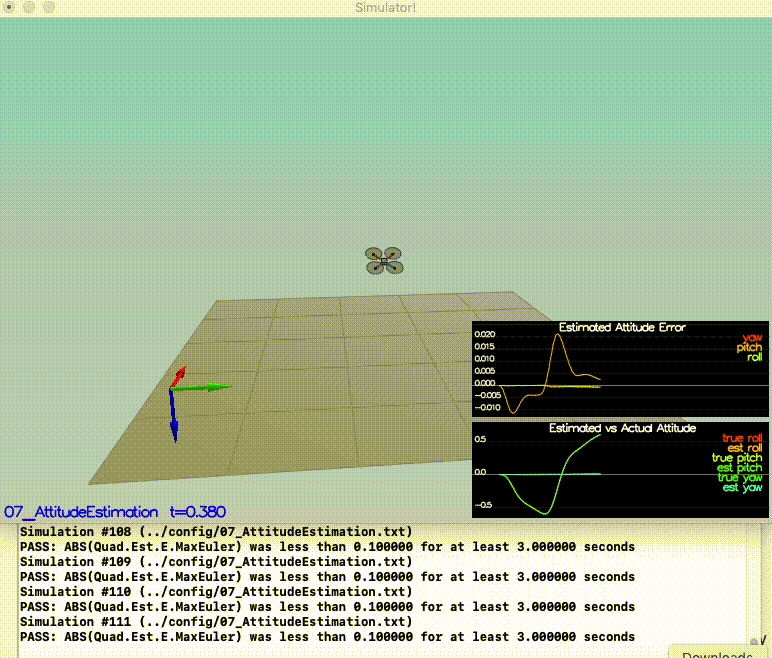

# Estimation Project #

Welcome to the estimation project.  In this project, i developed the estimation portion of the controller used in the CPP simulator.  By the end of the project, my simulated quad flew with my estimator and my custom controller (from the previous project)!

This README is broken down into the following sections:
 - [Project Structure](#Project-Structure)
 - [The Scenarios](#the-scenarios)
 - [Results (Videos)](#results)


## Project Structure ##

For this project, you will be interacting with a few more files than before.

 - The EKF was implemented in `QuadEstimatorEKF.cpp`

 - The EKF implementation exposes both the estimated state and a number of additional variables. In particular:

   - `Quad.Est.E.X` is the error in estimated X position from true value.  More generally, the variables in `<vehicle>.Est.E.*` are relative errors, though some are combined errors (e.g. MaxEuler).

   - `Quad.Est.S.X` is the estimated standard deviation of the X state (that is, the square root of the appropriate diagonal variable in the covariance matrix). More generally, the variables in `<vehicle>.Est.S.*` are standard deviations calculated from the estimator state covariance matrix.

   - `Quad.Est.D` contains miscellaneous additional debug variables useful in diagnosing the filter. You may or might not find these useful but they were helpful to us in verifying the filter and may give you some ideas if you hit a block.

   - Parameters for tuning the EKF are in the parameter file `QuadEstimatorEKF.txt`

 - When you turn on various sensors (the scenarios configure them, e.g. `Quad.Sensors += SimIMU, SimMag, SimGPS`), additional sensor plots will become available to see what the simulated sensors measure.


## The Scenarios ##

 - [1: Sensor Noise](#1-sensor-noise-scenario-06_noisysensors)
 - [2: Attitude Estimation](#2-attitude-estimation-scenario-07_attitudeestimation)
 - [3: Prediction](#3-prediction-scenario-08_predictstate-and-scenario-09_predictioncov)
 - [4: Magnetometer Update](#4-magnetometer-update-scenario-10_magupdate)
 - [5: GPS Update](#5-gps-update-scenario-11_gpsupdate)
 - [6: Update Controller](#6-update-controller)

### 1: Sensor Noise (scenario `06_NoisySensors`) ###

In order to make the quadcopter realistic, sensor noise had to be factored in. After running the simulator for the Sensor Noise scenario, the GPS X data and Accelerometer X data, which were recorded respectively as Graph 1 and Graph 2 in the log directory, was processed to determine the standard deviation. Graph 1 and Graph 2 were comma seprated value (csv) files. 

Each of these csv files were loaded and the standard deviation was computed `src/Sensor_Noise.ipynb`

Then standard deviation values was then plugged into the `config/6_Sensornoise.txt`, specifically as the values for `MeasuredStdDev_GPSPosXY` and `MeasuredStdDev_AccelXY` and the simulation was run again. 

It was observed that the standard deviations accurately captured the value of approximately 68% of the respective measurements as shown in the clip below.


### 2: Attitude Estimation (scenario `07_AttitudeEstimation`) ###

The next step was the improve the complementary filter-type attitude filter with a better rate gyro attitude integration scheme. 

The `UpdateFromIMU()` function in the `QuadEstimatorEKF.cpp` file was modified to calculate the pitch and roll angles by defining a quaternion for the euler angles for φ, θ and ψ using state. The built in IntegrateBodyRate method of the Quaternion was used to impove the performance when predicting the pitch and roll angles.


The code shown below to compute pitch and roll angles are in lines [106-125](src/QuadEstimatorEKF.cpp#L106) of the `QuadEstimatorEKF.cpp`:

```
float phi = rollEst;
    float theta = pitchEst;
    
    Mat3x3F R = Mat3x3F();
    R(0,0) = 1;
    R(0,1) = sin(phi) * tan(theta);
    R(0,2) = cos(phi) * tan(theta);
    R(1,0) = 0;
    R(1,1) = cos(phi);
    R(1,2) = -sin(phi);
    R(2,0) = 0;
    R(2,1) = sin(phi) / cos(theta);
    R(2,2) = cos(phi) / cos(theta);
    V3F euler_dot = R * gyro ;
    float predictedPitch = pitchEst + dtIMU * euler_dot.y;
    float predictedRoll = rollEst + dtIMU * euler_dot.x;
    ekfState(6) = ekfState(6) + dtIMU * euler_dot.z;    // yaw
    // normalize yaw
    if (ekfState(6) > F_PI) ekfState(6) -= 2.f*F_PI;
    if (ekfState(6) < -F_PI) ekfState(6) += 2.f*F_PI;
```

Upon implementing the code and running the Attitude estimation simulation again, it was observed that the estimated attitude (Euler Angles) was within 0.1 rad for each of the Euler angles for atleast 3 seconds as shown below.



### 3: Prediction (scenario `08_PredictState` and scenario `09_PredictionCov`) ###

The next step was to implement the prediction step of my filter. 

A partial derivative of the body-to-global rotation matrix (RGB matrix) was implemented in the `GetRbgPrime()` method in the `QuadEstimatorEKF.cpp` file.


The code shown below to implement the RGB Matrix are in lines [234-249](src/QuadEstimatorEKF.cpp#L234) of the `QuadEstimatorEKF.cpp`:

```
    float cosTheta = cos(pitch);
    float sinTheta = sin(pitch);
    
    float cosPhi = cos(roll);
    float sinPhi = sin(roll);
    
    float sinPsi = sin(yaw);
    float cosPsi = cos(yaw);
    
    RbgPrime(0,0) = - cosTheta * sinPsi;
    RbgPrime(0,1) = - sinPhi  * sinTheta * sinPsi - cosTheta * cosPsi;
    RbgPrime(0,2) = - cosPhi  * sinTheta * sinPsi + sinPhi   * cosPsi;
    
    RbgPrime(1,0) = cosTheta * cosPsi;
    RbgPrime(1,1) = sinPhi  * sinTheta * cosPsi - cosPhi * sinPsi;
    RbgPrime(1,2) = cosPhi  * sinTheta * cosPsi + sinPhi * sinPsi;
```

Upon implementing this function, the `Predict()` function was implemented to predict the state covariance forward by running the covariance prediction scenario and tuning the `QPosXYStd` and the `QVelXYStd` process parameters in `QuadEstimatorEKF.txt`. This was to try to capture the magnitude of the error.

The code shown below to predict covariance are in lines [297-305](src/QuadEstimatorEKF.cpp#L297) of the `QuadEstimatorEKF.cpp`:

```
    gPrime(0,3) = dt;
    gPrime(1,4) = dt;
    gPrime(2,5) = dt;
    
    gPrime(3, 6) = (RbgPrime(0) * accel).sum() * dt;
    gPrime(4, 6) = (RbgPrime(1) * accel).sum() * dt;
    gPrime(5, 6) = (RbgPrime(2) * accel).sum() * dt;
    
    ekfCov = gPrime * ekfCov * gPrime.transpose() + Q;
```

The follow covariance prediction was observed


The predict covariance function calls the PredictState() function, which was modified to take into account accelerations and velocities. The accelerations that are input into this method (accel values) are body frame accelerations and so they needed to be converted to inertial frame values by calling the Rotate_BtoI(accel) function as shown below. Gravity of -9.8 m/s^2 was factored in as well. 

This is implemented in lines [188-207](src/QuadEstimatorEKF.cpp#L188)

```
    /**
     x coordianate x= x + x_dot * dt
     y coordianate y= y + y_dot * dt
     z coordianate z= z + z_dot * dt
     **/
    
    predictedState(0) = curState(0) + curState(3) * dt;
    predictedState(1) = curState(1) + curState(4) * dt;
    predictedState(2) = curState(2) + curState(5) * dt;
    //Convert the true acceleration
    V3F acc_inertial = attitude.Rotate_BtoI(accel);
    /**
     change in velocity along the x is a_x * dt
     change in velocity along the y is a_y * dt
     change in velocity along the z is a_z * dt by removing the gravity component
     **/
    
    predictedState(3) = curState(3) + acc_inertial.x * dt;
    predictedState(4) = curState(4) + acc_inertial.y * dt;
    predictedState(5) = curState(5) + acc_inertial.z * dt - CONST_GRAVITY * dt;
```


When this code was run, it was observed that the estimator state tracked the actual state with only a reasonably slow drift as shown below. 


### 4: Magnetometer Update (scenario `10_MagUpdate`) ###

In this step, information from the magnetometer is used to improve filter's performance in estimating the vehicle's heading. The parameter `QYawStd` in the `QuadEstimatorEKF.txt` file was tuned to better balance the long term drift and short-time noise from the magnetometer. The function `UpdateFromMag()` was also updated to estimate the vehicle's heading. 

Section 7.3.2 of the [Estimation for Quadrotors](https://www.overleaf.com/read/vymfngphcccj) was used to implement the magnetometer update. 


```
    zFromX(0) = ekfState(6);
    float diff = magYaw - ekfState(6);
    if ( diff > F_PI ) {
        zFromX(0) += 2.f*F_PI;
    } else if ( diff < -F_PI ) {
        zFromX(0) -= 2.f*F_PI;
    }
    
    hPrime(0, 6) = 1;
```
Upon implementing the above code , in lines [364-372](src/QuadEstimatorEKF.cpp#L364), the following was observed. 


### 5: GPS Update (scenario `11_GPSUpdate`) ###

In this section we take GPS into account. I turned off the ideal estimator configuration setting (`Quad.UseIdealEstimator`) and then commented out the realistic IMU (as shown below) in the `config/11_GPSUpdate.txt` file.
```
#SimIMU.AccelStd = 0,0,0
#SimIMU.GyroStd = 0,0,0
```
Then I implemented a simple loop construct in the `UpdateFromGPS()` (as shown below) method to implement EKF using GPS update and re-ran the simulation. Lines [330-338](src/QuadEstimatorEKF.cpp#L330) show the code for implmenting this GPS update. 
```
    for ( int i = 0; i < 6; i++) {
        zFromX(i) = ekfState(i);
    }
    
    
    for ( int i = 0; i < 6; i++) {
        hPrime(i,i) = 1;
    }
```

The following was observed with an estimated position error of < 1m. for the entire simulation. 


### 6: Update Controller ###

The `QuadController.cpp` and `QuadControlParams.txt` were replaced with the files developed in the Controller project and all the scenarios were successfully run. 


## Results ##
The videos of each of the above mentioned scenarios can be found in the [videos](videos) directory.


